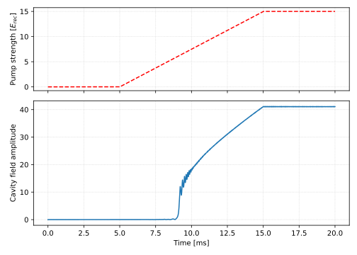

Callbacks
----------

Callbacks provide a way to interact with the simulation during its execution. They are functions that are called at specific points of the simulation, and they can be used to perform any kind of operation. For example, they can be used to save the state of the simulation or to monitor the evolution of some quantity. The common behavior of a callback is defined by the :class:`~torchgpe.utils.callbacks.Callback` class, which allows to interact with the propagation (regardless of whether it is in real or imaginary time) before it starts, before and after each epoch, and after it ends. In addition, TorchGPE will provide callbacks with an instance of the :class:`~torchgpe.bec2D.gas.Gas` class and with details on the simulation parameters, before it starts. This allows the potential to access the gas parameters, such as the number of particles, the mass, etc, as well as the runtime-specific settings such as the time step. 

Implemented callbacks
=====================

Here, we want to provide an overview of the implemented callbacks. Please, refer to the API documentation and the advanced usage section for more details on the structure of the callbacks and how to implement custom ones.

LInfNorm
********
Callback to monitor the changes in the wave function. This is especially useful during imaginary time propagation to assess the convergence of the algorithm. When initialized, :class:`~torchgpe.utils.callbacks.LInfNorm` takes the parameters :py:attr:`compute_every` and :py:attr:`print_every`. The first one defines how often the callback is called (once every :py:attr:`compute_every` epochs), while the second one defines how often the callback prints the norm. By default, ``compute_every = 1`` and ``print_every = 1``. This callback computes the :math:`L_\infty` norm, defined as 

.. math::

    L_\infty = \text{max}_{\vec{r}}|\Psi_t - \Psi_{t+\Delta t}|,

where :math:`\Psi_t` is the wave function at time :math:`t` and :math:`\Delta t` is the time step.

The :py:attr:`~torchgpe.utils.callbacks.LInfNorm.norms` attribute contains the history of the computed values.

L1Norm
********
Callback to monitor the changes in the wave function. This is especially useful during imaginary time propagation to assess the convergence of the algorithm. When initialized, :class:`~torchgpe.utils.callbacks.L1Norm` takes the parameters :py:attr:`compute_every` and :py:attr:`print_every`. The first one defines how often the callback is called (once every :py:attr:`compute_every` epochs), while the second one defines how often the callback prints the norm. By default, ``compute_every = 1`` and ``print_every = 1``. This callback computes the :math:`L_1` norm, defined as 

.. math::

    L_1 = \sum_{\vec{r}}|\Psi_t - \Psi_{t+\Delta t}| \, d\vec{r},

where :math:`\Psi_t` is the wave function at time :math:`t`, :math:`\Delta t` is the time step and :math:`d\vec{r}` is the volume element.

The :py:attr:`~torchgpe.utils.callbacks.L1Norm.norms` attribute contains the history of the computed values.

L2Norm
********
Callback to monitor the changes in the wave function. This is especially useful during imaginary time propagation to assess the convergence of the algorithm. When initialized, :class:`~torchgpe.utils.callbacks.L2Norm` takes the parameters :py:attr:`compute_every` and :py:attr:`print_every`. The first one defines how often the callback is called (once every :py:attr:`compute_every` epochs), while the second one defines how often the callback prints the norm. By default, ``compute_every = 1`` and ``print_every = 1``. This callback computes the :math:`L_2` norm, defined as 

.. math::

    L_2 = \sqrt{\sum_{\vec{r}}|\Psi_t - \Psi_{t+\Delta t}|^2 \, d\vec{r}}

where :math:`\Psi_t` is the wave function at time :math:`t`, :math:`\Delta t` is the time step and :math:`d\vec{r}` is the volume element.

The :py:attr:`~torchgpe.utils.callbacks.L2Norm.norms` attribute contains the history of the computed values.

CavityMonitor
*************

The :class:`~torchgpe.bec2D.potentials.DispersiveCavity` potential allows to define two time dependent parameters: :py:attr:`lattice_depth` and :py:attr:`cavity_detuning`. The :class:`~torchgpe.bec2D.callbacks.CavityMonitor` callback allows to monitor such parameters, together with the intracavity field :math:`\alpha`. When initialized, it takes the parameters :py:attr:`save_every` and :py:attr:`dispersive_cavity`. The first one defines how often the callback is called (once every :py:attr:`save_every` epochs), while the second one specifies the cavity to monitor. 

At the end of the propagation, the :py:attr:`~torchgpe.bec2D.callbacks.CavityMonitor.pump`, :py:attr:`~torchgpe.bec2D.callbacks.CavityMonitor.cavity_detuning`, :py:attr:`~torchgpe.bec2D.callbacks.CavityMonitor.times` and :py:attr:`~torchgpe.bec2D.callbacks.CavityMonitor.alpha` attributes contain lists of PyTorch tensors with the history of the monitored quantities.

.. note:: 
    A cavity monitor instance can be used to monitor the same cavity in multiple propagations. For this reason, the monitored data are stored in 2D arrays where the first index is the index of the propagation and the second index is the index of the monitored quantity. For example, :py:attr:`pump[0]` contains the values of the :py:attr:`lattice_depth` parameter in the first propagation, while :py:attr:`pump[1]` contains the values of the :py:attr:`lattice_depth` parameter in the second propagation.

**Example:** 

.. code-block:: python
    :emphasize-lines: 2, 14, 20, 22
    :linenos:

    from torchgpe.bec2D import Gas
    from torchgpe.bec2D.callbacks import CavityMonitor
    from torchgpe.bec2D.potentials import Contact, Trap, DispersiveCavity
    from torchgpe.utils.potentials import linear_ramp

    import numpy as np
    import torch
    import matplotlib.pyplot as plt 

    depth = linear_ramp(0, 5e-3, 15, 15e-3)
    
    contact = Contact()
    trap = Trap(400, 400) 
    cavity = DispersiveCavity(lattice_depth=depth, cavity_detuning=-15e6, atomic_detuning=-76.6e9, cavity_decay=150e3, cavity_coupling=1.95e6, waist=np.inf)

    bec = Gas("87Rb", N_particles=2e5, N_grid=2**8, grid_size=2e-5, float_dtype=torch.float32, complex_dtype=torch.complex64)
    bec.psi = torch.exp(-(bec.X**2 + bec.Y**2)/(2*(1e-6/bec.adim_length)**2))
    bec.ground_state([trap, contact], callbacks=[], time_step=-1e-8j, N_iterations=10000)

    monitor = CavityMonitor(cavity)

    bec.propagate(20e-3, 1e-6, [cavity, trap, contact], [monitor])

    fig, ax = plt.subplots(2, 1, figsize=(7, 5), sharex=True, height_ratios=[1, 1.5])
    ax = ax.flatten()

    # ********************
    # Plotting the results
    # ********************

    ax[0].plot(monitor.times[0]*1000, monitor.pump[0], c="r", ls="--")
    ax[1].plot(monitor.times[0]*1000, torch.abs(monitor.alpha[0]))

    ax[1].set_xlabel("Time [ms]")
    ax[0].set_ylabel("Pump strength [$E_{rec}$]")
    ax[1].set_ylabel("Cavity field amplitude")
    ax[0].grid("both", ls=":", c="lightgray")
    ax[1].grid("both", ls=":", c="lightgray")

Animation
*********

The :class:`~torchgpe.bec2D.callbacks.Animation` callback allows to create an animation of the evolution of different properties of the gas. It can be used to generate a video of the density evolution, both in real and momentum space, of the wave function's phase, or of the potential landscape. Additionally, it allows to monitor the cavity field and any additional time dependent variable. 

When initialized, it takes the parameters:

- :py:attr:`output_file` (the path of the ``mp4`` file where to save the animation),
- :py:attr:`save_every` (how often the callback is called, once every :py:attr:`save_every` epochs),
- :py:attr:`fps` (the frames per second of the output video),
- :py:attr:`cores` (the number of cores used to merges the frames).
- :py:attr:`density` (whether to plot the density in real space),
- :py:attr:`phase` (whether to plot the phase of the wave function),
- :py:attr:`densityk` (whether to plot the density in momentum space),
- :py:attr:`potentials` (whether to plot the potential landscape),
- :py:attr:`cavities` (the cavities to be monitored),
- :py:attr:`time_dependent_variables` (the time dependent variables to be plotted).

.. note:: 
    The length of the resulting animation can be calculated as 
    
    .. math::

        \text{length} = \frac{\text{N_iterations}}{\text{save_every} \cdot \text{fps}},

    where N_iterations is the number of iterations of the propagation. 
    
    While for a propagation in imaginary time this parameter is directly specified, for one in real time this is equal to the final time divided by the time step. Calling :math:`T` the final time and :math:`\Delta t` the time step, the length of the animation is equal to 
    
    .. math::
        
        \frac{T}{\text{save_every} \cdot \text{fps} \cdot \Delta t}
        
.. danger::

    In order to create the animation, the callback needs to save all the frames in a temporary directory. This can take up a lot of space, especially if the animation is long. At the end of the animation, the temporary directory is deleted, and same happens in case of errors. 

    However, if the process is forcefully killed via the ``SIGKILL`` signal (e.g. via ``kill -9 PID``), the temporary directory cannot not be deleted. To handle this case, the callback maintains in the HOME directory of each user a list of temporary directories that are deleted at the beginning of the next animation. If this file is not present, the callback cannot guarantee that any leftover temporary directory is deleted and raises a warning.

    If you are sure that no temporary directory is left, you can safely ignore this warning. Otherwise, you should delete the directories manually by checking where your system stores temporary files. For example, on Linux systems, the temporary directory is usually ``/tmp``.
    

**Example:**

.. code-block:: python
    :emphasize-lines: 4, 19, 21, 23
    :linenos:
    
    from torchgpe.bec2D import Gas
    from torchgpe.bec2D.potentials import Contact, Trap, DispersiveCavity
    from torchgpe.utils.potentials import s_ramp
    from torchgpe.bec2D.callbacks import Animation

    import torch

    bec = Gas(N_particles=2e5, grid_size=3e-5)

    sigma = 1e-6
    bec.psi = torch.exp( -(bec.X**2 + bec.Y**2)/(2*(sigma/bec.adim_length)**2) )

    contact = Contact(a_s = 100)
    trap = Trap(omegax = 400, omegay = 400)

    bec.ground_state(potentials=[trap, contact], N_iterations=1e4)

    depth = s_ramp(0, 0, 15, 5e-3)
    cavity = DispersiveCavity(lattice_depth=depth, cavity_detuning=-15e6, atomic_detuning=-76.6e9, cavity_decay=150e3, cavity_coupling=1.95e6)

    animation = Animation("/path/to/file/animation.mp4", density=True, phase=False, densityk=False, potentials=False, cavities=[cavity], time_dependent_variables=[("Pump strength", depth)], save_every=33, fps=25, cores=4)

    bec.propagate(10e-3, 1e-6, [cavity, trap, contact], [animation])

.. image:: ../_static/quickstart_self_organisation.gif
    :align: center
    :width: 300
    :alt: Real time animation
