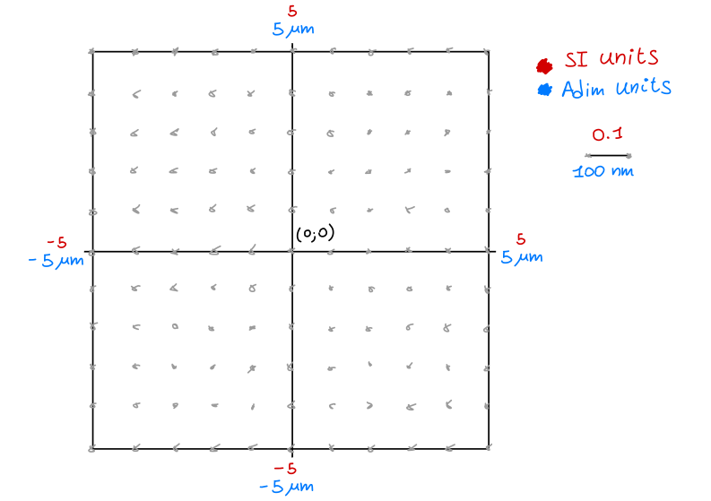

The Gas class 
--------------

The :class:`~torchgpe.bec2D.gas.Gas` class represents the quantum gas to be simulated.

It is initialized specifying the atomic species, the number of atoms, and details on the region of space to be studied. After setting a first wave function of the gas via the :py:attr:`~torchgpe.bec2D.gas.Gas.psi` or :py:attr:`~torchgpe.bec2D.gas.Gas.psik` attributes, the :py:meth:`~torchgpe.bec2D.gas.Gas.ground_state` and :py:meth:`~torchgpe.bec2D.gas.Gas.propagate` methods can be used to evolve the wave function in time. :py:meth:`~torchgpe.bec2D.gas.Gas.ground_state` performs imaginary time evolution to find the ground state of the system, while :py:meth:`~torchgpe.bec2D.gas.Gas.propagate` performs real time evolution to study its dynamics. Both methods use the split-step Fourier method to solve the Gross-Pitaevskii equation.

The atomic species is specified by the :py:attr:`element` parameter, which is a string (``'87Rb'`` by default). If :py:attr:`element` is a species supported by GPE, its parameters are automatically loaded. The only supported species at the moment are ``'87Rb'`` and ``'39K'``, which are defined in  :py:attr:`~torchgpe.utils.elements.elements_dict`. This is a dictionary where each element is associated with its mass and the angular frequency of its :math:`d_2` line, e.g.:

.. code-block:: python
    :linenos:

    import numpy as np
    import scipy.constants as spconsts

    # dictionary stored in torchgpe.utils.elements

    elements_dict = {
        "87Rb": {
            "m": spconsts.physical_constants["atomic mass constant"][0] * 87,
            "omega d2": 2 * np.pi * 384.2304844685e12,
        },
        "39K": {
            "m": spconsts.physical_constants["atomic mass constant"][0] * 39,
            "omega d2": 2 * np.pi * 391.01617003e12,
        },
    }

Additional atomic species can be specified by the user by adding new entries to the dictionary. Similarly, additional properties of the existing species can be added by modifying the corresponding entries.

Adimensionalization
~~~~~~~~~~~~~~~~~~~

In order to minimize the numerical errors due to the scale of the system, the wave function is evolved in dimensionless units. The length unit is provided by the :py:attr:`adimensionalization_length` parameter (hereafter referred to as :math:`l`); other adimensionalization parameters are inferred from it:

#. adimensionalization length: :math:`l` (available as :py:attr:`~torchgpe.bec2D.gas.Gas.adim_length`)
#. Adimensionalization pulse: :math:`\omega_l = \frac{\hbar}{m l^2}` (available as :py:attr:`~torchgpe.bec2D.gas.Gas.adim_pulse`)
#. Adimensionalization time: :math:`\tau_l = \frac{1}{\omega_l}`
#. Adimensionalization energy: :math:`E_l = \hbar \omega_l`

Therefore, to transform from adimensionalised units to SI units, one should multiply by the corresponding adimensionalization parameter. For example:

.. code-block:: python
    :linenos:

    x_SI = x_adim * gas.adim_length        # lengths
    w_SI = w_adim * gas.adim_pulse         # frequencies and pulses
    t_SI = t_adim / gas.adim_pulse         # times
    E_SI = E_adim * hbar * gas.adim_pulse  # energies

Computational grid
~~~~~~~~~~~~~~~~~~

The real space wave function is defined and evolved on a grid specified by the :py:attr:`~torchgpe.bec2D.gas.Gas.N_grid`, :py:attr:`~torchgpe.bec2D.gas.Gas.grid_size_x` and :py:attr:`~torchgpe.bec2D.gas.Gas.grid_size_y` parameters. The grid is centered in the origin, and the grid spacing is given by ``grid_size/((N_grid-1)*adimensionalization_length)``. For example, to study a wave function in a region of space :math:`10\mu m` wide, one should initialize the :class:`~torchgpe.bec2D.gas.Gas` class with the argument ``grid_size=10e-6``. Assuming :math:`l=1\mu m` and ``N_grid=101``, the resulting grid will span values from :math:`-5` to :math:`5` in adimensional units, with a grid spacing of :math:`\Delta = 0.1` (corresponding to :math:`100 \, nm` in SI units).

.. Check the grid spacing. from tests seems wrong

Similarly, the wave function in momentum space is defined on a grid that is related to the real space one by the application of a Fourier transform. In this case, before applying the transform, we pad the wave function to reduce the presence of boundary effects. Therefore, the wave function in momentum space has ``2*N_grid`` points per dimension, ranging values from :math:`-\frac{\pi}{\Delta}` to :math:`\frac{\pi}{\Delta}` in adimensional units. The adimensional unit of momentum is given by :math:`\frac{1}{l}` and hence the spacing between two sampled momenta is :math:`\tilde{\Delta} = \pi/(N_{grid} \cdot \Delta)`.

.. warning:: The grid will have ``2*N_grid`` points per side only if ``N_grid`` is even. Otherwise, the grid will have ``2*N_grid-1`` points per side.

Initialisation of the wave function
~~~~~~~~~~~~~~~~~~~~~~~~~~~~~~~~~~~~

The wave function can be initialized by assigning a value to either the :py:obj:`~torchgpe.bec2D.gas.Gas.psi` or :py:obj:`~torchgpe.bec2D.gas.Gas.psik` attributes. The :py:obj:`~torchgpe.bec2D.gas.Gas` class is written in such a way that the user can always read the wave function in both real and momentum space, no matter which one of the two is the last updated. In case the user tries to read the wave function in the space that is not the last updated, the wave function is automatically computed via a Fourier transform.

For example, to initialize the real space wave function to a Gaussian wave packet of size :math:`1\mu m`, one can use:

.. code-block:: python
    :linenos:
    :emphasize-lines: 5

    from torchgpe.bec2D import Gas
    import torch

    bec = Gas(N_particles=2e5, grid_size=1e-5)
    bec.psi = torch.exp( -(bec.X**2 + bec.Y**2)/(2*(1e-6/bec.adim_length)**2) )

Note that since the grid is expressed in adimensional units, the Gaussian width must be divided by the adimensionalization length.
Also, normalizing the wave function is not necessary, as the library takes care of it.

.. _fundamentals_gas_class_evolution:
    
Evolution
~~~~~~~~~

GPE evolves the wave function of the gas integrating the Gross-Pitaevskii equation in time. The equation is solved using the split-step Fourier method, which consists in alternating the application of the kinetic and potential operators in real and momentum space.

Consider an Hamiltonian :math:`\hat{H} = \hat{T} + \hat{V}`, where :math:`\hat{T}` is the kinetic term (diagonal in momentum space) and :math:`\hat{V}` is the potential one, assumed diagonal in real space. The time evolution from time :math:`t` to time :math:`t+\Delta t` is given by the operator

.. math::
    U = \exp(-\frac{i}{\hbar}\hat{H}\Delta t).

Since :math:`\hat{T}` and :math:`\hat{V}` don't commute, the operator :math:`U` cannot be factorized. However, defining the dimensionless operators

.. math::
    \tilde{T} = -\frac{i}{\hbar}\hat{T}\Delta t \quad \text{and} \quad \tilde{V} = -\frac{i}{\hbar}\hat{V}\Delta t

and making use of the Baker-Campbell-Hausdorff formula, one can write

.. math::
    U &= \exp(\tilde{T}+\tilde{V}) = \exp(\tilde{T}/2 + \tilde{V} + \tilde{T}/2)\\
      &= e^{\tilde{T}/2}e^{\tilde{V} + \tilde{T}/2}\exp(-\frac{1}{2}\left[\tilde{T}/2,\tilde{V}\right] + \mathcal{O}\left(\Delta t^3\right))\\
      &= e^{\tilde{T}/2}e^{\tilde{V}}e^{\tilde{T}/2}\exp(-\frac{1}{2}\left[\tilde{T}/2,\tilde{V}\right] -\frac{1}{2}\left[\tilde{V},\tilde{T}/2\right] + \mathcal{O}\left(\Delta t^3\right))\\
      &= e^{\tilde{T}/2}e^{\tilde{V}}e^{\tilde{T}/2}e^{\mathcal{O}\left(\Delta t^3\right)}.

That is, the subsequent application of the kinetic propagator :math:`e^{\tilde{T}/2}` followed by the potential one :math:`e^{\tilde{V}}` and the kinetic propagator one last time is equivalent to the application of the full operator :math:`U` up to third order in :math:`\Delta t`.

Ground state
************

The :py:meth:`~torchgpe.bec2D.gas.Gas.ground_state` method uses the split-step Fourier method to evolve the wave function in imaginary time to find the ground state of the system. The method takes as input the number of iterations to perform, the time step to use, the list of the potentials acting on the system and, optionally, a set of callbacks to monitor the evolution. Note that imaginary time evolution does not support the use of a time-dependent potential. After checking that the time step is indeed a purely imaginary number, the method integrates the Gross Pitaevskii equation taking care of renormalising the wave function after each step. At the end of the propagation, the :py:obj:`~torchgpe.bec2D.gas.Gas.psi` and :py:obj:`~torchgpe.bec2D.gas.Gas.psik` attributes are updated to the final wave function.

Real time propagation
*********************

The :py:meth:`~torchgpe.bec2D.gas.Gas.propagate` method uses the split-step Fourier method to evolve the wave function in real time. The method takes as input the time step to use, the final time, the list of the potentials acting on the system and, optionally, a set of callbacks to monitor the evolution. Note that the time step can be slightly adjusted to ensure that the wave function is evaluated at the final time. The method integrates the Gross Pitaevskii equation taking care of renormalising the wave function after each step. At the end of the propagation, the :py:obj:`~torchgpe.bec2D.gas.Gas.psi` and :py:obj:`~torchgpe.bec2D.gas.Gas.psik` attributes are updated to the final wave function.