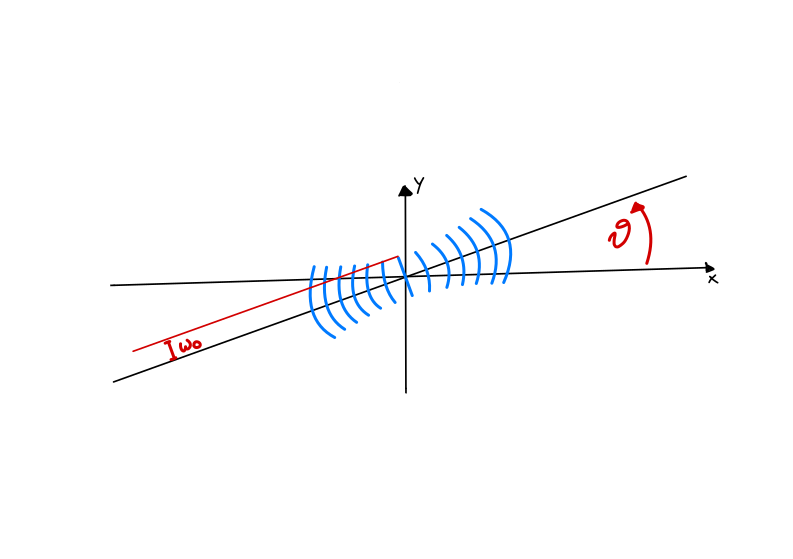
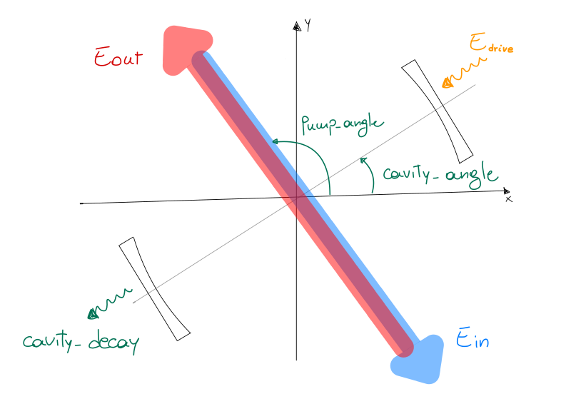

Potentials
----------

Potentials describe the experimental apparatus to be simulated. The common behavior of any potential is defined in the :class:`~torchgpe.utils.potentials.Potential` class, from which both :class:`~torchgpe.utils.potentials.LinearPotential` and :class:`~torchgpe.utils.potentials.NonLinearPotential` inherit. Distinguishing between linear and non-linear potentials allows to separate the computation of the linear and non-linear parts of the Hamiltonian, which are computed separately in the propagation. This allows to optimize the computation of the linear part, which does not change during the evolution. 

Linear potentials must implement the :py:meth:`~torchgpe.utils.potentials.LinearPotential.get_potential` method, which takes the coordinates of the grid (:py:attr:`~torchgpe.bec2D.gas.Gas.X` and :py:attr:`~torchgpe.bec2D.gas.Gas.Y` for a 2D grid) and an optional parameter :py:obj:`time`, and returns the linear potential evaluated on the grid. For time independent potentials, the function is called with ``time=None`` and :py:obj:`time` should be ignored by the potential.

Similarly, non-linear potentials implement the :py:meth:`~torchgpe.utils.potentials.NonLinearPotential.potential_function` function. This takes the same parameters as :py:meth:`~torchgpe.utils.potentials.LinearPotential.get_potential`, with the addition of the wave function :py:attr:`~torchgpe.bec2D.gas.Gas.psi`. The function returns the non-linear potential evaluated on the grid.

Both kinds of potentials can be provided with additional parameters when instantiated. In addition, TorchGPE will provide them with an instance of the Gas class when the simulation starts, via the method :py:meth:`~torchgpe.utils.potentials.Potential.set_gas`. This allows the potential to access the gas parameters, such as the number of particles, the mass, etc. After the gas is set and before the propagation is run, the function :py:meth:`~torchgpe.utils.potentials.Potential.on_propagation_begin` is called on the potential. This allows the potential to perform any further initialization using the properties contained in the gas.

Note that some potentials support time dependent parameters. These can be provided by passing them a function of time instead of a constant value. For example, while ``Trap(omegax=100, omegay=100)`` creates a trap with constant frequencies, 

.. code-block:: python
    :linenos:

    Trap(omegax=lambda t: 100+np.sin(t), omegay=lambda t: 100+np.cos(t))
    
creates a trap whose frequencies oscillate in time.

Some common time dependencies are implemented already for convenience: :py:meth:`~torchgpe.utils.potentials.linear_ramp`, :py:meth:`~torchgpe.utils.potentials.s_ramp` and :py:meth:`~torchgpe.utils.potentials.quench` implement a linear ramp, a smooth one, and a quench experiment, respectively. 

For example, if the potential :py:obj:`ExamplePotential` supports a time dependent parameter :py:attr:`strength`, the sweep of the parameter from ``0`` to ``1`` in :math:`1\, ms` can be achieved with

.. code-block:: python
    :linenos:

    potential = ExamplePotential(strength=linear_ramp(0, 1, 1e-3))

.. note::

    If a constant value is passed to a time dependent parameter, it will be converted to a function that returns the same value for any time. In other words, the following two lines are equivalent

    .. code-block:: python
        :linenos:

        potential = ExamplePotential(strength=1)
        potential = ExamplePotential(strength=lambda t: 1)

.. note::

    As TorchGPE works with adimensionalized units, the potentials should be implemented in such a way that the returned values are also adimensional.

Implemented potentials
======================

Here, we want to provide an overview of the implemented potentials. Please, refer to the API documentation and the advanced usage section for more details on the structure of the potentials and how to implement custom ones.

Linear potentials
~~~~~~~~~~~~~~~~~

Zero
****
The :class:`~torchgpe.bec2D.potentials.Zero` potential is the default one. It is a linear potential that returns zero for any position and time. Because of this, it is not necessary to provide any parameter to instantiate it.

Trap
****

:class:`~torchgpe.bec2D.potentials.Trap` implements an harmonic trap potential. When initialized, it takes the parameters :py:attr:`omegax` and :py:attr:`omegay`, which are the frequencies in :math:`Hz` of the trap in the x and y directions, respectively. Note that both the frequencies are time dependent parameters, and hence they can be both constants or functions of time. 

The returned potential is

.. math::

    \text{Trap}(x, y, t) = 2 \pi^2 \left( \frac{\omega_x\left(t\right)^2}{\omega_l^2} x^2 + \frac{\omega_y\left(t\right)^2}{\omega_l^2} y^2 \right),

where :math:`x` and :math:`y` are the adimensionalized coordinates, :math:`\omega_x` and :math:`\omega_y` are the provided frequencies (in SI units) and :math:`\omega_l` is the adimensionalisation pulse.

SquareBox
*********

:class:`~torchgpe.bec2D.potentials.SquareBox` implements a square box potential centered at the origin. When initialized, it takes the parameters :py:attr:`V` and :py:attr:`D`, which are the depth and size of the box, respectively. Similarly to the :class:`~torchgpe.bec2D.potentials.Trap` case, both the parameters are passed in SI units, and adimensionalized by the potential itself. 

The returned potential is

.. math::

    \text{SquareBox}(x, y) = \begin{cases}
        {V}/{\hbar \omega_l} & \text{if } \left|x\right| < {D}/{2l} \text{ and } \left|y\right| < {D}/{2l} \\
        0 & \text{otherwise}
    \end{cases},

where :math:`l` is the adimensionalisation length.

RoundBox
********

:class:`~torchgpe.bec2D.potentials.RoundBox` implements a round box potential centered at the origin. When initialized, it takes the parameters :py:attr:`V` and :py:attr:`D`, which are the depth and diameter of the box, respectively. Similarly to the :class:`~torchgpe.bec2D.potentials.Trap` case, both the parameters are passed in SI units, and adimensionalized by the potential itself. 

The returned potential is

.. math::

    \text{RoundBox}(x, y) = \begin{cases}
        {V}/{\hbar \omega_l} & \text{if } \sqrt{x^2 + y^2} < {D}/{2l} \\
        0 & \text{otherwise}
    \end{cases},

Lattice
*******

:class:`~torchgpe.bec2D.potentials.Lattice` implements the lattice potential produced by a gaussian beam. When initialized, it takes the parameters:

- :py:attr:`V0` (the lattice depth), 
- :py:attr:`lam` (the wave length), 
- :py:attr:`theta` (the angle with respect to the horizontal), 
- :py:attr:`phi` (the phase of the beam),
- :py:attr:`w0` (the waist of the gaussian beam).

Note that :py:attr:`V0` should be provided in units of the recoil energy :math:`E_r = \hbar^2 k^2 / 2m`, where :math:`k = 2 \pi / \lambda` is the wave number of the lattice. The other parameters are passed in SI units, and adimensionalized by the potential itself. 
Both :py:attr:`V0` and :py:attr:`phi` are time dependent parameters, and hence they can be both constants or functions of time. By default, the waist :py:attr:`w0` is set to infinity, which corresponds to a plane wave.

When the waist is set to be different than infinity, the returned potential also accounts for the wavefront curvature and the Gouy phase. 

In its simplest form (that is, when ``theta = 0`` and ``w0 = np.Inf`` ), the returned potential is:

.. math::

    \text{Lattice}(x, y, t) = \frac{V_0 \cdot E_{rec}}{\hbar \omega_l} \cos\left(\frac{2 \pi l}{\lambda} x+\phi\right)^2

where :math:`E_{rec} = \hbar^2 k^2 / 2m` is the recoil energy, :math:`l` is the adimensionalisation length and :math:`\lambda` and :math:`\phi` the parameters :py:attr:`lam` and :py:attr:`phi` respectively.

.. seealso::

    The `Wikipedia page on the gaussan beam <https://en.wikipedia.org/wiki/Gaussian_beam>`_ provides details on how is the potential changed when the waist is finite.

Non-linear potentials
~~~~~~~~~~~~~~~~~~~~~

.. _fundamentals_potentials_contact:

Contact
*******

:class:`~torchgpe.bec2D.potentials.Contact` implements the contact interaction potential. When initialized, it takes the parameters :py:attr:`a_s` and :py:attr:`a_orth`, which are the scattering length and a renormalization factor for the transverse direction, respectively. The scattering length :py:attr:`a_s` is expressed in units of the Bohr radius :math:`a_B`.

The returned potential is

.. math::

    \text{Contact}(x, y, \psi, t) = \sqrt{8\pi}N \frac{a_s a_B}{a_\perp} \left\|\psi\right\|^2,

where :math:`N` is the number of particles and :math:`a_\perp` is the renormalization factor :py:attr:`a_orth`.

Note that the interaction strength for a 3D system, which reads :math:`g_{3D} = 4 \pi \hbar^2 a_s a_B / m`, is now divided by a factor :math:`\sqrt{2\pi}a_\perp` to account for the missing third dimension. The orthogonal scattering length :math:`a_\perp` satisfies the equation :math:`a_\perp^2 = a_{ho}^2 \sqrt{1+2 a_s N \left\|\psi\right\|^2}`, where :math:`a_{ho}` is the length scale of the harmonic oscillator generating the confinment in the :math:`z` direction. For weakly interacting systems, :math:`a_\perp^2 \approx a_{ho}`.

.. seealso::

    Reference for the dimensionality reduction procedure:
    
    Salasnich, L., Parola, A., Reatto, L., 2002. Effective wave equations for the dynamics of cigar-shaped and disk-shaped Bose condensates. Phys. Rev. A 65, 043614. `https://doi.org/10.1103/PhysRevA.65.043614 <https://doi.org/10.1103/PhysRevA.65.043614>`_

DispersiveCavity
****************

:class:`~torchgpe.bec2D.potentials.DispersiveCavity` describes the dispersive interaction of the BEC with a transversally driven cavity mode. When initialized, it takes the parameters:

- :py:attr:`lattice_depth` (the strength of the pump. Supports time-dependent parameters),
- :py:attr:`atomic_detuning` (the detuning of the atoms with respect to the pump),
- :py:attr:`cavity_detuning` (the detuning of the cavity with respect to the pump. Supports time-dependent parameters),
- :py:attr:`cavity_decay` (the decay rate of the cavity),
- :py:attr:`cavity_coupling` (the coupling constant between the gas and the cavity),
- :py:attr:`cavity_angle` (the angle of the cavity with respect to the horizontal),
- :py:attr:`pump_angle` (the angle of the pump with respect to the horizontal),
- :py:attr:`waist` (the waist of the gaussian pump beam).
- :py:attr:`cavity_probe` (the on-axis probe field. Supports time-dependent parameters).

Note that the lattice depth is expressed in units of the recoil energy :math:`E_r = \hbar^2 k^2 / 2m`, where the wave number :math:`k` is computed from the :math:`d_2` pulse of the atomic species the gas is made of, and the specified atomic detuning.
Additionally, observe that :py:attr:`atomic_detuning`, :py:attr:`cavity_detuning` and :py:attr:`cavity_decay` have to be considered frequencies. The corresponding rates are obtained by the potential itself, by multiplying them by :math:`2 \pi`.

:py:attr:`waist` is the waist of the gaussian pump beam. It defaults to infinity, which corresponds to a plane wave. Note that differently from the :class:`~torchgpe.bec2D.potentials.Lattice` potential, the :class:`~torchgpe.bec2D.potentials.DispersiveCavity` potential does not account for the wavefront curvature and the Gouy phase. 

Finally, an additional on-axis probe field can be added to the potential via the :py:attr:`cavity_probe`. This is useful to study the response of the system to a perturbation. A pre-defined probe field is defined in :py:meth:`~torchgpe.utils.potentials.probe_pulse`

The returned potential is made of three terms: the pump lattice, the cavity lattice and the pump-cavity interference. 
In their simplest form (that is, when ``cavity_angle = 0``, ``pump_angle = np.pi`` and ``waist = np.Inf`` ), they read:

.. math::

    \text{pump_lattice}(x, y, \psi, t) = \frac{\Delta_A}{\left|\Delta_A\right|} \frac{V_0 \cdot E_{rec}}{\hbar \omega_l} \cos\left(k \cdot y\right)^2

.. math::

    \text{cavity_lattice}(x, y, \psi, t) = \frac{g_0^2}{\Delta_A \omega_l} \left|\alpha\right|^2 \cos\left(k \cdot x\right)^2 

.. math::

    \text{interaction}(x, y, \psi, t) = \frac{g_0}{\omega_l} \sqrt{ \frac{V_0 \cdot E_{rec}}{\hbar \Delta_A}} \Re\left(\alpha\right) \cos\left(k\cdot x\right)  \cos\left(k\cdot y\right)

The total potential is then the sum of the three terms.

In the expressions above, we have defined the following quantities:

- :math:`\Delta_A` is the pulse associated to the specified atomic detuning,
- :math:`E_{rec}` is the recoil energy,
- :math:`V_0` is the lattice depth in units of the recoil energy,
- :math:`k` is the wave number of the pump lattice,
- :math:`g_0` is the coupling strength between the gas and the cavity,
- :math:`\alpha` is cavity field.