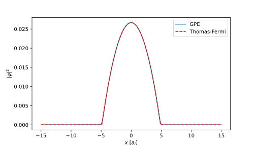

TorchGPE quickstart
=================

This page contains a quick introduction to the TorchGPE package, helping new users run their first simulations. 

Creating a BEC
--------------

At the very core of TorchGPE, there is the :class:`~torchgpe.bec2D.gas.Gas` class. An instance of :class:`~torchgpe.bec2D.gas.Gas` describes a Bose-Einstein condensate, stores its wave function both in real and momentum space and manages its evolution. We can create a :math:`^{87}\text{Rb}` BEC by importing the :class:`~torchgpe.bec2D.gas.Gas` class from the sub-module of bidimensional simulations and instantiating it:

.. code-block:: python
    :linenos:

    from torchgpe.bec2D import Gas

    bec = Gas(N_particles=2e5, grid_size=3e-5)

When :class:`~torchgpe.bec2D.gas.Gas` is instantiated, multiple parameters can be set. For example, different atomic species can be used, as well as different numbers of particles. It can be specified if TorchGPE should run on CPU or GPU and also the precision of the variables to use (e.g. whether to store floats in 32 or 64 bits). Moreover, the wave function is sampled on a grid of points whose number and distance can also be specified when instantiating the gas. In the example, we are studying a square region of space of side :math:`30 \mu m`.

.. seealso::
    See :doc:`fundamentals.gas_class` for a detailed description of the :class:`~torchgpe.bec2D.gas.Gas` class and its parameters.

Initializing the wave function
------------------------------

Regardless of whether we want to use TorchGPE to find the ground state of the BEC or to propagate its wave function in real time, the first thing to do after instantiating the :class:`~torchgpe.bec2D.gas.Gas` is to define an initial wave function. This can be done by setting the attributes :py:attr:`~torchgpe.bec2D.gas.Gas.psi` or :py:attr:`~torchgpe.bec2D.gas.Gas.psik`. The two are related by a Fourier transform, and hence setting either one of the two suffices. For example, we can initialize the BEC with a Gaussian wave function in real space as follows:

.. code-block:: python
    :linenos:
    :emphasize-lines: 3, 7, 8

    from torchgpe.bec2D import Gas

    import torch

    bec = Gas(N_particles=2e5, grid_size=3e-5)
    
    sigma = 1e-6
    bec.psi = torch.exp( -(bec.X**2 + bec.Y**2)/(2*(sigma/bec.adim_length)**2) )

In the example above, we generate a Gaussian wave packet evaluated on the real-space grid given by :py:attr:`~torchgpe.bec2D.gas.Gas.X` and :py:attr:`~torchgpe.bec2D.gas.Gas.Y`. The size of the packet is specified by :py:obj:`sigma`, which has been set to :math:`1\,\mu m`. Observe that the wave function does not need to be normalized as TorchGPE will do it during the initialization. Additionally, note that TorchGPE works with adimensionalized values. When instantiating :class:`~torchgpe.bec2D.gas.Gas`, the optional parameter :py:obj:`adimensionalization_length` can be specified (defaults to :math:`1\,\mu m`). The coordinates :py:attr:`~torchgpe.bec2D.gas.Gas.X` and :py:attr:`~torchgpe.bec2D.gas.Gas.Y` are then expressed in units of this adimensionalization length (:math:`a_l`), stored in :py:attr:`~torchgpe.bec2D.gas.Gas.adim_length`. Consequently, to express the size of the Gaussian packet in SI units we have to rescale its value by the adimensionalization length :py:attr:`~torchgpe.bec2D.gas.Gas.adim_length`.

.. seealso::
    See :doc:`fundamentals.gas_class` for more information on the adimensionalization.

Initializing the potentials
---------------------------

Once the wave function has been defined, we can run our first simulation with TorchGPE. To do so, we have to import the potentials defining our system. For this simple example, we will study a trapped gas with contact interactions, comparing it to the Thomas Fermi profile.

Both the harmonic trap and the contact interaction potentials are already implemented in TorchGPE, and can be easily imported and set up:

.. code-block:: python
    :linenos:
    :emphasize-lines: 4, 11, 12

    from torchgpe.bec2D import Gas
    from torchgpe.bec2D.potentials import Contact, Trap

    import torch

    bec = Gas(N_particles=2e5, grid_size=3e-5)
    
    sigma = 1e-6
    bec.psi = torch.exp( -(bec.X**2 + bec.Y**2)/(2*(sigma/bec.adim_length)**2) )

    contact = Contact(a_s = 100)
    trap = Trap(omegax = 400, omegay = 400)

The code above initializes a harmonic trap with frequencies along :math:`x` and :math:`y` of :math:`400\,\text{Hz}`, and sets up contact interactions between the particles with a scattering length of :math:`100\,a_{Bohr}`.

.. note:: 

    To account for the missing 3-rd dimension, the :class:`~torchgpe.bec2D.potentials.Contact` potential rescales the scattering length by the optional parameter ``a_orth`` (defaults to :math:`1\,\mu m`). In the weakly interacting limit, ``a_orth`` is well approximated by the length of a harmonic oscillator with a frequency equal to that of the transversal trap. See :ref:`fundamentals_potentials_contact` for more information.

Imaginary time propagation
---------------------------

At this point we can just call the :py:meth:`~torchgpe.bec2D.gas.Gas.ground_state` function to run imaginary time propagation and compute the ground state wave function:

.. code-block:: python
    :linenos:
    :emphasize-lines: 14

    from torchgpe.bec2D import Gas
    from torchgpe.bec2D.potentials import Contact, Trap

    import torch

    bec = Gas(N_particles=2e5, grid_size=3e-5)
    
    sigma = 1e-6
    bec.psi = torch.exp( -(bec.X**2 + bec.Y**2)/(2*(sigma/bec.adim_length)**2) )

    contact = Contact(a_s = 100)
    trap = Trap(omegax = 400, omegay = 400)

    bec.ground_state(potentials=[trap, contact], N_iterations=1e4)

:py:meth:`~torchgpe.bec2D.gas.Gas.ground_state` allows for the definition of multiple runtime parameters, but their discussion goes beyond what is needed for this simple quickstart guide. 
When :py:meth:`~torchgpe.bec2D.gas.Gas.ground_state` is called, the initial wave function we specified is evolved in imaginary time for a fixed number of iterations (:math:`10^4` in this example). Once the propagation is complete, the updated wave function can be accessed via the :py:attr:`~torchgpe.bec2D.gas.Gas.psi` attribute. The error committed during the propagation is related to the number of iterations and the time step used. 

.. seealso::
    See :ref:`fundamentals_gas_class_evolution` for more information on the propagation via the Split-Step Fourier method, and :py:meth:`~torchgpe.bec2D.gas.Gas.ground_state` for details on the runtime parameters.

Plotting a section of the density profile :py:attr:`~torchgpe.bec2D.gas.Gas.density`, we can compare its shape to the theoretical one given by the Thomas-Fermi approximation. In the figure below we show in blue the result coming from the simulation with the TorchGPE package, together with the Thomas-Fermi profile (dashed red).

The two curves perfectly overlap. Observe that the scale on the :math:`x` axis is in adimensionalized units. Multiplying by the adimensionalization lenght one finds the coordinates in SI units.

.. seealso::
    See :doc:`fundamentals.gas_class` for more information on the adimensionalization.

Real time propagation
---------------------------

The ground state wave function we just computed can be then evolved in real time under static or time-dependent potentials. For example, we can imagine that the gas is in a cavity and we slowly increase the strength of a transverse pump. :class:`~torchgpe.bec2D.potentials.DispersiveCavity` implements a transversally pumped cavity potential, where the strength of the pump can either be a constant or change in time. For this example, we increase the pump strength according to an s-shaped function from :math:`0` to :math:`15` recoil energies in :math:`5 \text{ms}`:

.. code-block:: python
    :linenos:
    :emphasize-lines: 2, 3, 17, 18

    from torchgpe.bec2D import Gas
    from torchgpe.bec2D.potentials import Contact, Trap, DispersiveCavity
    from torchgpe.utils.potentials import s_ramp

    import torch

    bec = Gas(N_particles=2e5, grid_size=3e-5)
    
    sigma = 1e-6
    bec.psi = torch.exp( -(bec.X**2 + bec.Y**2)/(2*(sigma/bec.adim_length)**2) )

    contact = Contact(a_s = 100)
    trap = Trap(omegax = 400, omegay = 400)

    bec.ground_state(potentials=[trap, contact], N_iterations=1e4)

    depth = s_ramp(0, 0, 15, 5e-3)
    cavity = DispersiveCavity(lattice_depth=depth, cavity_detuning=-15e6, atomic_detuning=-76.6e9, cavity_decay=150e3, cavity_coupling=1.95e6)

Note that we use the pre-defined function :py:meth:`~torchgpe.utils.potentials.s_ramp`, which returns a callable. Similarly, the :py:meth:`~torchgpe.utils.potentials.linear_ramp` and :py:meth:`~torchgpe.utils.potentials.quench` implement a linear ramp and a sudden quench, respectively. In addition, any custom single-valued function of time can be used to define the pump strength.

:py:meth:`~torchgpe.bec2D.gas.Gas.propagate` performs the real time propagation in a specified time range, discretising it in steps of a given duration. For example, we can propagate the wave function for :math:`10\,\text{ms}` in steps of :math:`1\,\mu\text{s}`:

.. code-block:: python
    :linenos:
    :emphasize-lines: 20

    from torchgpe.bec2D import Gas
    from torchgpe.bec2D.potentials import Contact, Trap, DispersiveCavity
    from torchgpe.utils.potentials imports_ramp

    import torch

    bec = Gas(N_particles=2e5, grid_size=3e-5)
    
    sigma = 1e-6
    bec.psi = torch.exp( -(bec.X**2 + bec.Y**2)/(2*(sigma/bec.adim_length)**2) )

    contact = Contact(a_s = 100)
    trap = Trap(omegax = 400, omegay = 400)

    bec.ground_state(potentials=[trap, contact], N_iterations=1e4)

    depth = s_ramp(0, 0, 15, 5e-3)
    cavity = DispersiveCavity(lattice_depth=depth, cavity_detuning=-15e6, atomic_detuning=-76.6e9, cavity_decay=150e3, cavity_coupling=1.95e6)

    bec.propagate(10e-3, 1e-6, [cavity, trap, contact])

When :py:meth:`~torchgpe.bec2D.gas.Gas.propagate` is called, the wave function of the gas is evolved in real time. Before running the code, however, we introduce a useful concept that allows us to monitor the evolution of the wave function during the propagation, that is the one of `callback`. Callbacks are classes whose instances can be provided to the evolution method and that can execute custom snippets of code after each step of the propagation. For example, the :class:`~torchgpe.bec2D.callbacks.Animation` callback allows to plot the evolution in time of the cloud density both in real and momentum space, its phase in real space and the potential landscape. It also allows monitoring of the cavity field and the value of time-dependent variables like the lattice depth in this example. 

.. seealso::
    See :doc:`fundamentals.callbacks` for more information on the implemented callbacks.

The code below uses the :class:`~torchgpe.bec2D.callbacks.Animation` callback to produce a video of the evolution of the density of the cloud and the cavity field:

.. code-block:: python
    :linenos:
    :emphasize-lines: 4, 21, 23

    from torchgpe.bec2D import Gas
    from torchgpe.bec2D.potentials import Contact, Trap, DispersiveCavity
    from torchgpe.utils.potentials import s_ramp
    from torchgpe.bec2D.callbacks import Animation

    import torch

    bec = Gas(N_particles=2e5, grid_size=3e-5)
    
    sigma = 1e-6
    bec.psi = torch.exp( -(bec.X**2 + bec.Y**2)/(2*(sigma/bec.adim_length)**2) )

    contact = Contact(a_s = 100)
    trap = Trap(omegax = 400, omegay = 400)

    bec.ground_state(potentials=[trap, contact], N_iterations=1e4)

    depth = s_ramp(0, 0, 15, 5e-3)
    cavity = DispersiveCavity(lattice_depth=depth, cavity_detuning=-15e6, atomic_detuning=-76.6e9, cavity_decay=150e3, cavity_coupling=1.95e6)

    animation = Animation("/path/to/file/animation.mp4", density=True, phase=False, densityk=False, potentials=False, cavities=[cavity], time_dependent_variables=[("Pump strength", depth)], save_every=33, fps=25, cores=4)

    bec.propagate(10e-3, 1e-6, [cavity, trap, contact], [animation])

The :class:`~torchgpe.bec2D.callbacks.Animation` callback temporarily stores all the data to be plotted, to generate and join together the images at the end of the propagation. Note that generating the images can be a lengthy process, but it can be parallelized over different cores. In the figure below we show the evolution of the cloud's density throughout time, together with the cavity field and the pump strength in the bottom panel. We see that when the pump strength is approximately :math:`5` recoil energies, the bec undergoes a phase transition and the cavity field abruptly increases.

.. image:: ../_static/quickstart_self_organisation.gif
    :align: center
    :width: 300
    :alt: Real time animation

This quickstart guide has shown how to set up and run a simple simulation with TorchGPE. In the next sections we will delve deeper into the package, discussing the different potentials and the runtime parameters that can be set.